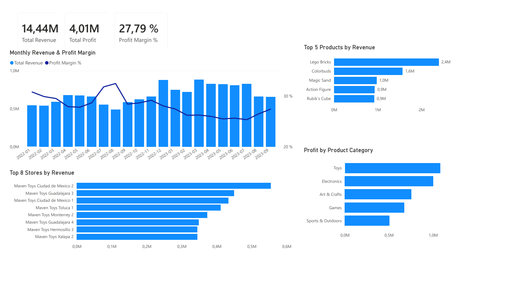

# Sales Performance Analysis

829,262 retail sales transactions

638 trading days · 50 stores · 35 products · 5 product categories

PostgreSQL · SQL · Power BI · DAX

---

## Validated Findings

- Revenue increased over the observed period.
- Profit increased more slowly than revenue.
- Profit Margin fluctuated over time.
- Revenue was concentrated in a small number of products.
- Revenue varied considerably across stores.
- Profit differed across product categories.

---

## Data Preparation

Sales, product, store and calendar data were integrated in PostgreSQL.

Revenue, cost, profit and profit margin were calculated in SQL.

A SQL view supplied the Power BI data model.

---

## Analytical Scope

The analysis evaluated sales performance across four business dimensions:

- Time
- Products
- Stores
- Product categories
