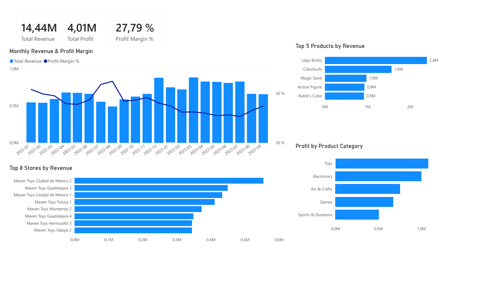

# Retail Sales Analysis

**829,262 sales transactions · 50 stores · SQL · PostgreSQL · Power BI · DAX**

Retail sales and inventory analysis for a fictitious toy store chain in Mexico, covering revenue, profit, margin, product concentration, store-level comparisons, and seasonality.



## Key Findings

- **Jan–Sep 2023 vs. Jan–Sep 2022: revenue +30.9%, units sold +40.8%, profit +16.0%, profit margin 29.6% → 26.2%.**
- **Top five products: 46.8% of total revenue.** **Lego Bricks** led revenue at $2.39M with a 12.5% margin; **Colorbuds** led profit at $835K with a 53.4% margin.
- **Airport stores averaged $430K revenue and $126K profit per store, compared with $283K and $78K for Downtown stores.** The dataset contains 3 Airport stores and 29 Downtown stores.
- **The inventory snapshot contains 29,742 units and 77 explicit zero-stock records; 157 store-product combinations are missing.** Missing combinations are not classified as zero stock. Estimated inventory value is about $300K at cost and $410K at retail price.
- **April 30 was a high-revenue date in both years.** April 30, 2023 had the highest daily revenue in the dataset ($66.8K); April 30, 2022 generated $47.5K. April 30 is Mexico's annual *Día de la Niña y el Niño*; this provides context for the pattern but does not establish causality.

## Summary Metrics

| Metric | Value |
|---|---:|
| Sales transactions | 829,262 |
| Units sold | 1,090,565 |
| Revenue | $14.44M |
| Cost | $10.43M |
| Profit | $4.01M |
| Profit margin | 27.79% |
| Stores | 50 |
| Cities | 29 |
| Products | 35 |
| Product categories | 5 |

## Dataset

The project uses the [Maven Analytics – Mexico Toy Sales](https://mavenanalytics.io/data-playground/mexico-toy-sales) dataset (Public Domain), containing sales and current inventory data for a fictitious toy store chain in Mexico.

The sales data covers **January 2022 through September 2023**.

| Table | Role | Rows |
|---|---|---:|
| `sales.csv` | Daily sales transactions | 829,262 |
| `calendar.csv` | Calendar dates | 638 |
| `stores.csv` | Store master data | 50 |
| `products.csv` | Product, category, cost, and price data | 35 |
| `inventory.csv` | Current stock by store and product | 1,593 |

## Workflow

```text
Raw CSV files
    ↓
PostgreSQL
    ↓
Sales + Products + Stores
    ↓
Transaction-level analytical view
    ↓
Summary metrics / time / product / store analysis
    ↓
Power BI + DAX
    ↓
Sales dashboard

Inventory + final 30 days of sales
    ↓
Inventory value / zero-stock / days-of-cover calculations
```

The transaction-level sales view calculates **revenue, cost, and profit for each sales record**. The same definitions are used for SQL validation and Power BI reporting.

## SQL Analysis

The repository contains separate SQL files for the main calculations:

- [`create_sales_analysis_view.sql`](sql/create_sales_analysis_view.sql) – joins sales, store, and product tables and calculates revenue, cost, and profit at transaction level.
- [`kpi_queries.sql`](sql/kpi_queries.sql) – recalculates the summary metrics reported in the README.
- [`analysis_queries.sql`](sql/analysis_queries.sql) – contains queries for monthly trends, January–September year-over-year comparisons, product concentration, product and category profitability, store and location comparisons, and peak sales days.
- [`inventory_queries.sql`](sql/inventory_queries.sql) – calculates inventory value, explicit zero-stock records, inventory-table completeness, and 30-day days of cover.

## Inventory Analysis

The inventory data is a **point-in-time snapshot**, not a historical stock series. The inventory queries calculate:

- stock on hand
- inventory value at cost and retail price
- explicit zero-stock records
- units sold over the final 30 days of the sales data
- estimated days of cover based on that 30-day sales rate

## Methodological Notes

- The dataset ends on **September 30, 2023**. Year-over-year comparisons therefore use **January to September 2022 and January to September 2023**, rather than comparing a full year with a partial year.
- Store-location comparisons use **average revenue and profit per store** because the number of stores differs substantially between location types. The dataset contains 3 Airport stores and 29 Downtown stores.
- The inventory table contains **1,593 observed store-product records** versus 1,750 theoretically possible combinations (50 × 35). The **157 absent combinations are treated as missing records, not as zero stock**.
- Inventory values are calculated from the point-in-time stock quantities and product cost and retail-price fields. They are not historical inventory valuations.
- The April 30 pattern is an observed association. External context identifies April 30 as Mexico's annual children's day, but the sales data alone cannot establish causality.

## Repository Structure

```text
sales-performance-analysis/
├── README.md
├── data/
│   └── raw/
│       ├── calendar.csv
│       ├── data_dictionary.csv
│       ├── inventory.csv
│       ├── products.csv
│       ├── sales.csv
│       └── stores.csv
├── images/
│   └── sales_dashboard.png
└── sql/
    ├── analysis_queries.sql
    ├── create_sales_analysis_view.sql
    ├── inventory_queries.sql
    └── kpi_queries.sql
```

## Sources

- [Maven Analytics – Mexico Toy Sales](https://mavenanalytics.io/data-playground/mexico-toy-sales)
- [Gobierno de México – Día de la Niña y el Niño](https://www.gob.mx/conapo/articulos/dia-de-la-nina-y-el-nino-363531?idiom=es)
